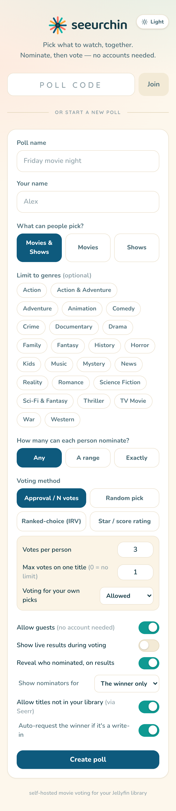
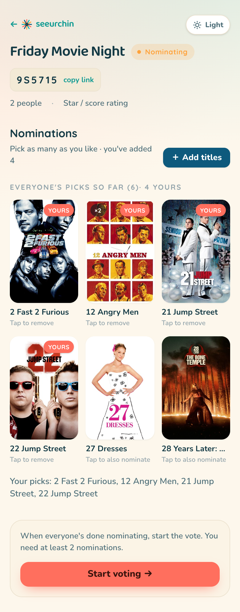
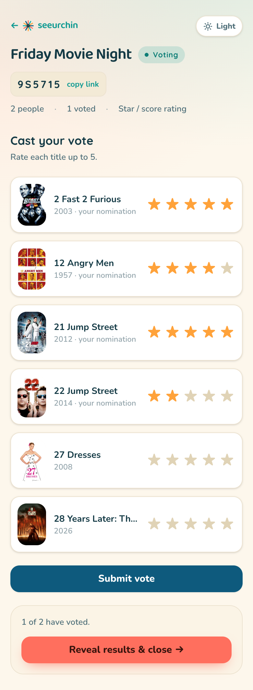
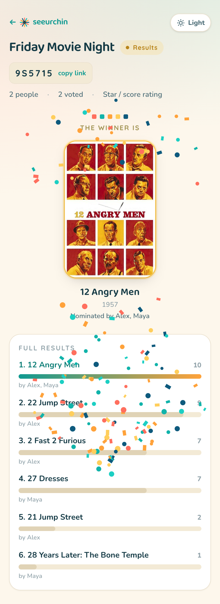
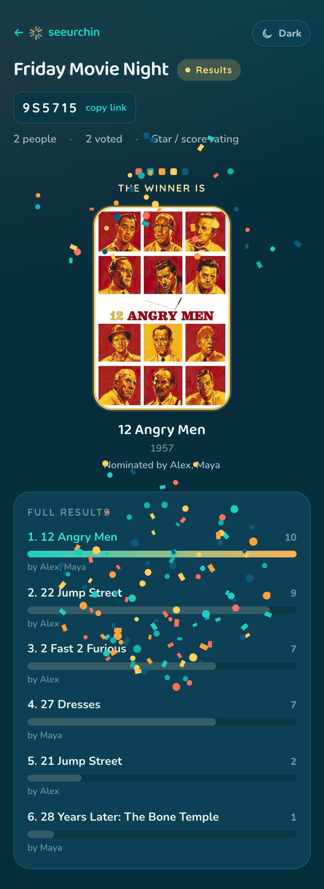

<div align="center">


# seeurchin

**Pick what to watch, together.**

A self-hosted, group movie &amp; show picker for [Jellyfin](https://jellyfin.org/).
Drop a link in a group chat and let everyone collectively decide what to watch
through a two-round poll — nominate titles straight from your own library, then
vote. Mobile-first, no accounts required, runs as a single small container
alongside your existing Jellyfin stack.

</div>

<table align="center">
<tr>
<td align="center"><br /><sub><b>Start a poll</b></sub></td>
<td align="center"><br /><sub><b>Round 1 — nominate</b></sub></td>
<td align="center"><br /><sub><b>Round 2 — vote</b></sub></td>
<td align="center"><br /><sub><b>Results</b></sub></td>
</tr>
</table>

---

## How it works

1. **Create a poll.** Pick the library scope (movies, shows, or both), a voting
   method, and optional nomination rules (min / max / required per person). You
   get a short share code and a link.
2. **Round 1 — Nominate.** Participants open the link, join with a display name,
   browse or search your Jellyfin library, and nominate titles. Duplicate
   nominations are merged and show how many people picked them.
3. **Round 2 — Vote.** The host starts voting and everyone casts a ballot using
   the poll's voting method. Ballots are editable until the round closes.
4. **Results.** The host closes the poll and the winner is revealed. Results can
   optionally update live during voting.

Everything updates in real time via Server-Sent Events — no refreshing.

## Features

- **Two-round flow** — nominate, then vote, with host-defined controls.
- **Four voting methods**, chosen per poll (see below), built on a pluggable
  engine so new methods are a single registration — including a no-vote
  **random pick**.
- **Guest-friendly** — participants just enter a display name; no Jellyfin
  account needed. (Built behind an auth seam so Jellyfin login can be added.)
- **Browse your real library** — poster-grid search, scoped to movies/shows,
  optionally restricted to chosen **genres**. Posters are proxied through the
  backend, so the browser never sees your Jellyfin URL or API key. Duplicate
  library entries for the same title are collapsed automatically.
- **Flexible self-voting** — allow, forbid, or cap how much voters may back
  their own picks; optionally reveal who nominated the winner.
- **Write-ins via Seerr** *(optional)* — nominate titles you don't have yet by
  searching Seerr/TMDB, and auto-request a winning write-in so it downloads.
- **Short share codes** — ambiguity-free 6-character codes (Crockford base32,
  no `O/0/I/1/L` confusion), embedded in a tappable link.
- **Mobile-first** — designed for passing a phone around / dropping a link in a
  chat.
- **Light & dark, theme-aware** — the "Reef" design system adapts to system,
  light, or dark with no flash of the wrong theme.
- **Live updates** — counts, nominations, and results stream over SSE.
- **Tiny footprint** — a single ~13 MB distroless image; pure-Go SQLite, no
  external database.
- **Modern Jellyfin auth** — uses the `Authorization: MediaBrowser` header, not
  the legacy schemes Jellyfin removes in 10.13.

## Voting methods

| Method | Label in UI | Config keys (defaults) | How the winner is decided |
|---|---|---|---|
| **Approval** | Approval / N votes | `votes_per_user` (3), `max_votes_per_option` (1, `0` = unlimited), `allow_self_vote` (true) | Highest total weight across all ballots. With `max_votes_per_option: 1` this is plain approval voting. |
| **Ranked** | Ranked-choice (IRV) | `allow_self_vote` (true), `max_ranked` (0 = no limit) | Instant-runoff: eliminate the lowest first choice and redistribute until a title has a majority. |
| **Score** | Star / score rating | `max_score` (5), `aggregate` (`total`; or `average`), `allow_self_vote` (true) | Rate each title `0..max_score`; ranked by total (or average) score. |
| **Random** | Random pick | _none_ | No voting round — when the host closes round 1, one nomination is drawn uniformly at random. The draw is persisted so the winner is stable. |

Each method enforces its own ballot rules server-side (vote budgets, per-option
caps, and whether you may vote for a title you nominated). Voting for your own
picks can be open, disabled, or capped via `max_self_votes` (`<0` unlimited,
`0` none, `N` at most N — when set it overrides the legacy `allow_self_vote`).
Nomination rules (`min` / `max` / `required`) are enforced independently of the
voting method.

---

## Quick start (Docker)

Run it standalone, pointed at any reachable Jellyfin server:

```sh
export JELLYFIN_URL=http://your-jellyfin:8096
export JELLYFIN_API_KEY=...                      # Jellyfin Dashboard → API Keys
export SEEURCHIN_SESSION_SECRET=$(openssl rand -hex 32)
export SEEURCHIN_BASE_URL=http://localhost:5858
docker compose up --build
```

Open <http://localhost:5858>.

> **Getting a Jellyfin API key:** in Jellyfin, go to **Dashboard → API Keys →
> +**, name it `seeurchin`, and copy the key. This key is used only for reading
> the library; it's never exposed to the browser.

## Adding it to an existing Jellyfin stack

Add a service to your stack's `docker-compose.yml`, on the same Docker network
as Jellyfin so it can reach it by service name, and route a hostname to it
through your reverse proxy / Cloudflare tunnel:

```yaml
  seeurchin:
    image: seeurchin:latest          # or: build: ./seeurchin
    container_name: seeurchin
    init: true
    environment:
      - TZ=America/Chicago
      - JELLYFIN_URL=http://jellyfin:8096
      - JELLYFIN_API_KEY=<dashboard API key>
      - SEEURCHIN_BASE_URL=https://vote.example.com   # your public tunnel hostname
      - SEEURCHIN_SESSION_SECRET=<openssl rand -hex 32>
    volumes:
      - ./config/seeurchin:/config
    ports:
      - "5858:5858"                  # optional; the tunnel can reach it over the internal network
    networks:
      - media-network
    depends_on:
      - jellyfin
    restart: unless-stopped
```

Then add a public-hostname route in your tunnel (e.g. `vote.example.com` →
`http://seeurchin:5858`). Because `SEEURCHIN_BASE_URL` is set to the public
hostname — and copied share links are derived from whatever origin you open the
app at — links shared from the browser just work.

### Testing against a running stack

`docker-compose.stack.yml` runs seeurchin attached to an already-running stack's
network (it references the external network created by your main compose
project), so it talks to Jellyfin at the same internal URL it will use in
production:

```sh
export JELLYFIN_API_KEY=...
export SEEURCHIN_SESSION_SECRET=$(openssl rand -hex 32)
docker compose -f docker-compose.stack.yml up --build
```

Adjust the `name:` under `networks.media-network` to match your stack's network
(`docker network ls`).

---

## Configuration

All configuration is via environment variables.

| Variable | Required | Default | Description |
|---|---|---|---|
| `JELLYFIN_URL` | **yes** | — | Jellyfin base URL, e.g. `http://jellyfin:8096`. |
| `JELLYFIN_API_KEY` | **yes** | — | API key (Dashboard → API Keys) for library reads. |
| `SEEURCHIN_BASE_URL` | recommended | `http://localhost:5858` | Public origin used to build shareable links. Set to your tunnel hostname in production. |
| `SEEURCHIN_SESSION_SECRET` | recommended | random | HMAC secret for session cookies. A hex string (≥16 bytes) is decoded; anything else is used verbatim. If unset, a random secret is generated and **sessions won't survive a restart**. |
| `SEEURCHIN_ADDR` | no | `:5858` | TCP listen address. |
| `SEEURCHIN_DB_PATH` | no | `./seeurchin.db` | SQLite file path. Use a mounted volume (the image defaults to `/config`). |
| `SEEURCHIN_CODE_STYLE` | no | `base32` | Share-code style. Only `base32` is implemented today (`words` is planned). |
| `SEEURCHIN_ENABLE_USER_LOGIN` | no | `false` | Reserved for Jellyfin login (not yet implemented). |
| `SEERR_URL` | no | — | Seerr/Overseerr/Jellyseerr base URL, e.g. `http://seerr:5055`. Set with `SEERR_API_KEY` to enable write-in nominations + winner auto-request. |
| `SEERR_API_KEY` | no | — | Seerr API key (Settings → General → API Key). Use a dedicated account whose default profile is what you want requested; grant it auto-approve to have winners download without manual approval. |
| `SEERR_USER_ID` | no | API key owner | Seerr user id to attribute requests to (e.g. a dedicated "movie night" account), using that user's defaults. |
| `SEERR_MOVIE_PROFILE_ID` / `SEERR_TV_PROFILE_ID` | no | account default | Quality profile id applied to movie / TV requests. |
| `SEERR_MOVIE_ROOT_FOLDER` / `SEERR_TV_ROOT_FOLDER` | no | account default | Root folder for movie / TV requests. |
| `SEERR_SERVER_ID` | no | account default | Radarr/Sonarr server id to request against. |

The Docker image additionally defaults `SEEURCHIN_DB_PATH=/config/seeurchin.db`
and declares `/config` as a volume.

When `SEERR_URL` + `SEERR_API_KEY` are set, participants can nominate titles that
aren't in your library yet (searched via Seerr/TMDB), and a winning write-in is
auto-requested through Seerr — each per-poll toggleable. The request is made by
the account that owns the API key, using its default (or the configured) quality
profile; it only downloads automatically if that account is set to auto-approve.

---

## API

The frontend is a single-page app served from the same origin as the API (so no
CORS). All poll endpoints are scoped by share `code`; mutations require a
session cookie obtained from create or join.

| Method | Path | Description |
|---|---|---|
| `GET` | `/api/health` | Liveness check. |
| `GET` | `/api/features` | Optional capabilities, e.g. `{"seerr": true}`. |
| `GET` | `/api/methods` | Available voting methods and their default configs. |
| `GET` | `/api/genres?scope=` | Library genres for a scope (`movie`/`series`/`both`), for the genre picker. |
| `POST` | `/api/polls` | Create a poll (creator becomes host). Returns the poll view + sets cookie. |
| `GET` | `/api/polls/{code}` | Poll state, including your participation. |
| `POST` | `/api/polls/{code}/join` | Join as a guest (`{display_name}`); sets cookie. |
| `GET` | `/api/polls/{code}/library?q=&type=` | Search/browse the library (proxied). |
| `GET` | `/api/polls/{code}/search-external?q=` | Search Seerr/TMDB for write-in titles (when enabled). |
| `POST` | `/api/polls/{code}/nominations` | Nominate a library title (`{item_id}`) or a write-in (`{tmdb_id, media_type}`). |
| `DELETE` | `/api/polls/{code}/nominations/{id}` | Withdraw your nomination. |
| `POST` | `/api/polls/{code}/advance` | Host: advance the poll (round1 → round2 → closed). |
| `POST` | `/api/polls/{code}/votes` | Cast/replace your ballot (`{selections}`). |
| `POST` | `/api/polls/{code}/request/{id}` | Host: request a winning write-in via Seerr. |
| `GET` | `/api/polls/{code}/results` | Tally (when closed, or live if enabled). |
| `GET` | `/api/polls/{code}/events` | SSE stream of poll updates. |
| `GET` | `/api/items/{id}/image` | Poster image proxy. |

Create-poll body:

```json
{
  "title": "Movie Night",
  "host_name": "Alex",
  "library_scope": "movie",          // "movie" | "series" | "both"
  "submission_rules": { "min": 0, "max": 0, "required": 0 },
  "voting_method": "approval",       // "approval" | "ranked" | "score" | "random"
  "voting_config": null,             // method defaults used when null
  "allow_guests": true,
  "results_live": false,
  "reveal_nominators": false,        // show who nominated, on the results screen
  "reveal_scope": "winner",          // "winner" | "all" (when reveal_nominators)
  "genres": [],                      // restrict nominations to these genres (empty = any)
  "allow_writeins": false,           // allow nominating titles not in the library (needs Seerr)
  "auto_request_winner": false       // auto-request a winning write-in via Seerr on close
}
```

---

## Look &amp; feel

seeurchin wears the **"Reef"** design system: a token-driven, theme-aware
(**system / light / dark**) skin built on SvelteKit (Svelte 5) + Tailwind v4.
The mark is a twelve-spike urchin in the poll palette — coral, teal, mango,
ocean — radiating from an ink hub, reading as individual votes gathered around
a pick. The wordmark is lowercase **Baloo 2**.

<table align="center">
<tr>
<td align="center"><br /><sub><b>Light</b></sub></td>
<td align="center"><br /><sub><b>Dark</b></sub></td>
</tr>
</table>

- **Palette:** ocean `#0e5a7d`, teal `#11b3aa`, coral `#ff6f5e`, mango `#ffa23a`,
  sun `#ffce5c`, ink `#143a45`, sand `#fdf7ec`.
- **Type:** Baloo 2 (display/wordmark), Quicksand (titles), Nunito (body).
- **Conventions, tokens, and component classes:** see
  [`docs/design-system.md`](docs/design-system.md).
- **Brand source masters** (mark cuts, app-icon masters, the Baloo 2 font + OFL
  license) live in [`docs/brand/`](docs/brand/); the runtime favicon / app-icon
  kit + PWA manifest are in `web/static/brand/`.

> Screenshots are generated against a live instance by
> [`tools/screenshots`](tools/screenshots) — re-run it after a UI change to
> refresh the gallery above.

---

## Development

Backend (run the API on `:5859`; the frontend dev server proxies `/api` to it):

```sh
go test ./...                                   # backend tests
JELLYFIN_URL=http://localhost:8096 \
JELLYFIN_API_KEY=... \
SEEURCHIN_ADDR=:5859 \
go run ./cmd/seeurchin
```

Frontend (hot-reloading dev server on `:5173`):

```sh
cd web
npm install
npm run dev
```

## Build

The frontend compiles to static files that are embedded into the Go binary:

```sh
npm --prefix web ci
npm --prefix web run build        # writes internal/httpapi/webdist/
CGO_ENABLED=0 go build -o seeurchin ./cmd/seeurchin
```

Or just build the container (multi-stage: Node build → Go build → distroless):

```sh
docker build -t seeurchin:latest .
```

---

## Architecture

- **Backend:** Go — [`chi`](https://github.com/go-chi/chi) router, pure-Go
  SQLite via [`modernc.org/sqlite`](https://pkg.go.dev/modernc.org/sqlite) (no
  CGO), and the built frontend embedded with `embed.FS`.
- **Frontend:** SvelteKit (Svelte 5, static adapter, SPA) + Tailwind CSS v4,
  wearing the **"Reef"** design system — semantic tokens that re-map for light
  and dark, so theming is automatic (no `dark:` variants). See
  [`docs/design-system.md`](docs/design-system.md).
- **Live updates:** Server-Sent Events via an in-memory hub keyed by poll.
- **Sessions:** HMAC-signed, HTTP-only cookie holding a per-poll token map.
- **Identity:** guest provider now, behind an `auth.Provider` seam; participants
  already carry a nullable `jellyfin_user_id` so Jellyfin login can be added
  without a schema migration.

### Project layout

```
cmd/seeurchin        entrypoint + Jellyfin→domain adapter
internal/config      env-var configuration
internal/jellyfin    Jellyfin client (modern auth header, search, image proxy)
internal/store       SQLite repository (modernc.org/sqlite)
internal/poll        domain types + service (state machine, rules)
internal/voting      pluggable voting engine (approval, ranked, score, random)
internal/codes       Crockford base32 share codes
internal/auth        session cookies + provider seam (guest now, Jellyfin later)
internal/seerr       Seerr client (external search, winner auto-request)
internal/httpapi     REST + SSE handlers, embedded SPA
web/                 SvelteKit + Tailwind frontend ("Reef" design system)
docs/                design-system.md + brand source masters
tools/screenshots    Playwright generator for the README screenshots
```

---

## Roadmap

- **Jellyfin login** — authenticate participants against Jellyfin
  (`AuthenticateByName` + optional Quick Connect) using the modern auth header,
  with a per-poll "require login" toggle. The data model and auth seam are
  already in place.
- **Per-round history + admin** — a management view across polls.
- **Sudden-death runoff** and a **genre pre-round**.
- **Word-style share codes** (`SEEURCHIN_CODE_STYLE=words`).
- **Deadlines / auto-advance** between rounds.

## Status

**v1.1.0** — adds a **random pick** voting method, **genre-restricted**
nominations, an option to **reveal who nominated** on the results screen,
**capped self-voting** (`max_self_votes`), and a clearer round-1 nomination
screen, on top of v1.0. The UI now wears the **"Reef"** design system with
system / light / dark theming.

**v1.0.0** — the two-round flow, the core voting methods, guest identity, live
updates, library browsing, and Docker packaging are complete and in use.
</content>
